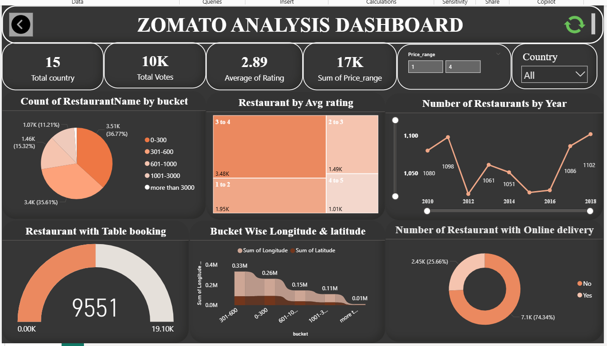
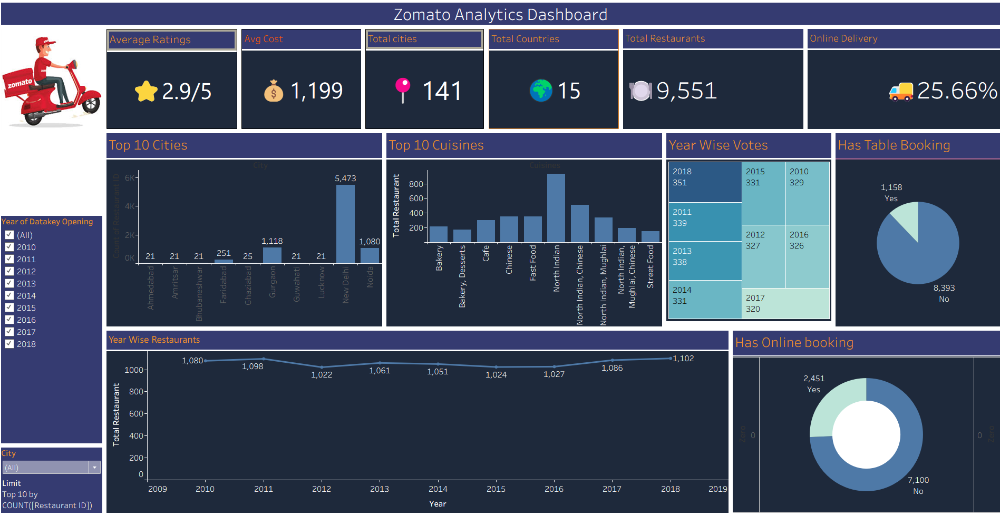

# 🍽️ Zomato Data Analytics Project

## 📊 Project Overview

This project is an end-to-end data analytics project based on Zomato restaurant data. The objective is to analyze restaurant performance, customer ratings, pricing, locations, table booking availability, and restaurant opening trends to generate meaningful business insights.

The project demonstrates practical skills in data cleaning, SQL analysis, Excel analysis, data visualization, and dashboard development using Power BI and Tableau.

---

## 🎯 Business Objectives

- Analyze the distribution and performance of restaurants.
- Identify restaurant opening trends over time.
- Analyze average restaurant ratings.
- Understand restaurant pricing patterns.
- Analyze table booking availability.
- Identify countries and locations with restaurant activity.
- Create interactive dashboards to support data-driven decision making.

---

## 🛠️ Tools & Technologies

- **Microsoft Excel** – Data cleaning, transformation and analysis
- **MySQL** – Data querying and business analysis
- **Power BI** – Interactive dashboard and KPI visualization
- **Tableau** – Interactive data visualization and dashboard development

---

## 🔄 Project Workflow

1. Data Collection
2. Data Cleaning & Transformation
3. Data Preparation using Excel
4. SQL Data Analysis
5. KPI Development
6. Dashboard Development
7. Business Insights Generation

---

## 📈 Key KPIs

- Total Restaurants
- Average Restaurant Rating
- Average Cost for Two
- Restaurants with Table Booking
- Restaurants by Country
- Restaurants by Rating
- Restaurant Opening Trends

---

## 🔍 Key Analysis

### Restaurant Trends
Analyzed the number of restaurants opened across different years, quarters, and months to identify growth patterns.

### Customer Ratings
Analyzed restaurant ratings to understand customer satisfaction and identify rating distributions.

### Pricing Analysis
Analyzed the average cost for two people and categorized restaurants based on pricing levels.

### Table Booking
Analyzed the availability of table booking facilities and compared restaurants with and without booking options.

### Geographic Analysis
Analyzed restaurant distribution across countries and locations.

---

## 📊 Dashboards

### Power BI Dashboard

The Power BI dashboard provides interactive visualizations for restaurant performance, ratings, pricing, booking availability, and restaurant trends.

### Tableau Dashboard

The Tableau dashboard provides interactive analysis and visual exploration of Zomato restaurant data.

---

## 📁 Project Structure

```text
Zomato-Data-Analytics/
│
├── README.md
│
├── Excel
│   └── Zomato Excel FINAL.xlsx
│
├── Power BI
│   └── Zomato Project PowerBI.pbix
│
├── SQL
│   └── Zomato_SQL QUERIES (1).sql
│
└── Tableau
    └── Tableau Project.twbx

---

💡 Skills Demonstrated

SQL data analysis
Excel data cleaning and analysis
Power BI dashboard development
Tableau dashboard development
Data visualization and business insights

📌 Project Outcome

Analyzed Zomato restaurant data to identify restaurant performance, ratings, pricing, booking availability, and opening trends, and presented the findings through interactive Power BI and Tableau dashboards.

## 📊 Dashboard Preview

### Power BI Dashboard



### Tableau Dashboard



